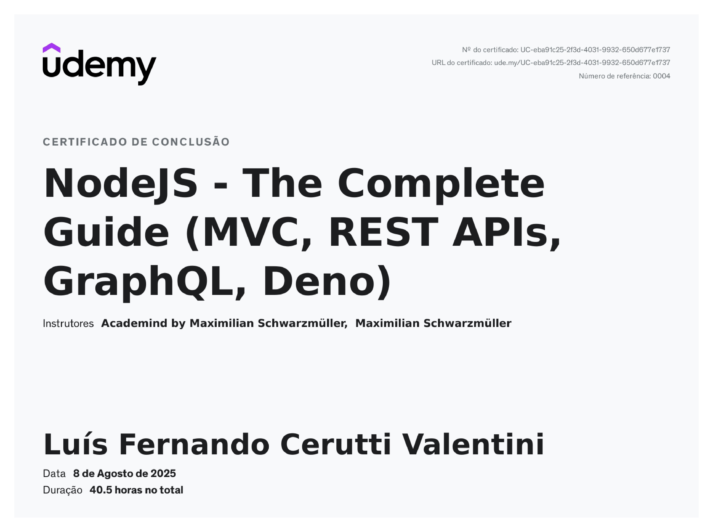
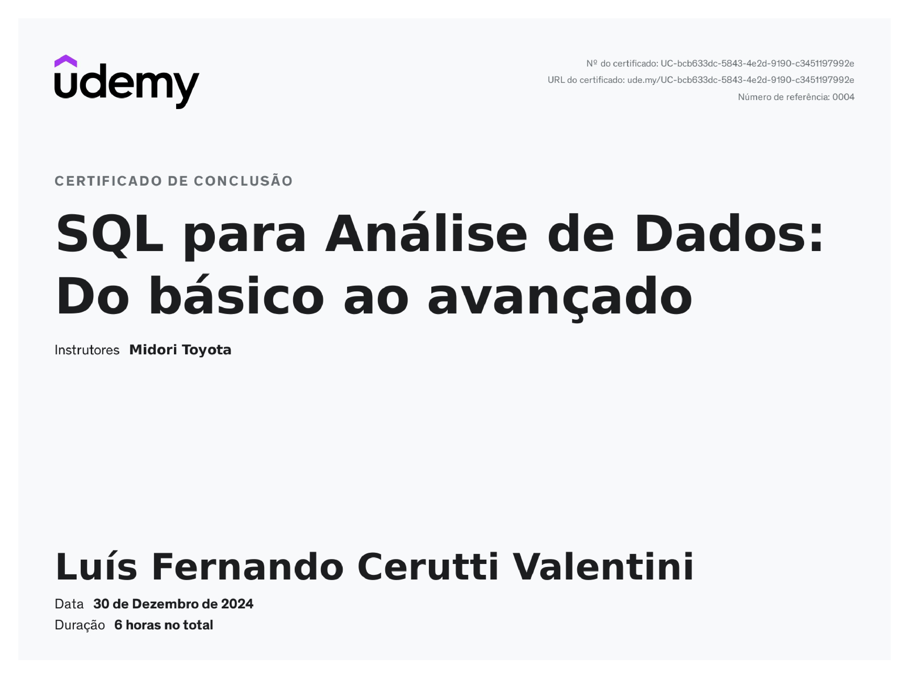
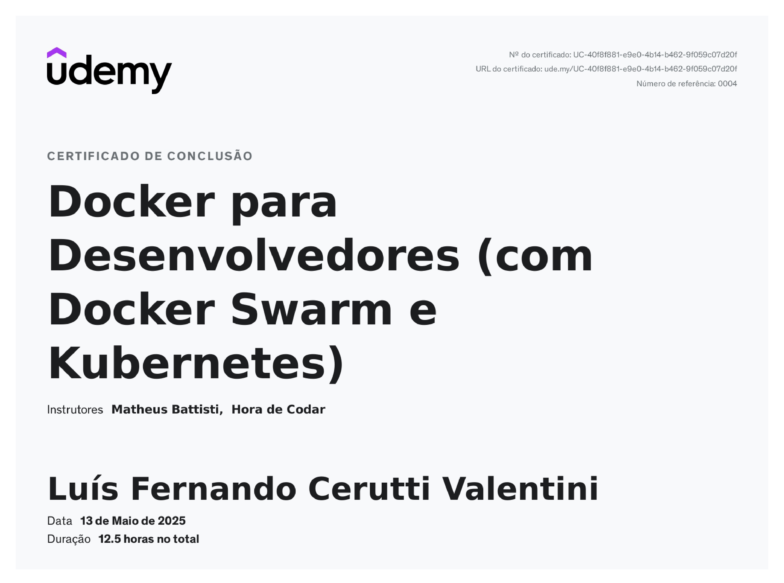

# Olá! 👋 

Sou Luís Fernando Valentini. Atualmente, estou concluindo o 5º período de Ciência da Computação na Universidade Federal da Fronteira Sul - Chapecó. Sou estudante regular de programação e computação no geral.

Tenho bastante interesse por estruturas de dados e algoritmos, bancos de dados (principalmente relacionais), desenvolvimento web full-stack (principalmente back-end), engenharia e análise de dados, entre outros tópicos.

# Projetos 👀

## Watch.IO

### Stack

Foram usadas as seguintes tecnologias no desenvolvimento do projeto:

* React.js (incluindo react-router, redux e react-query), e Tailwindcss para o desenvolvimento e estilização do front-end.

* Node.js e Express.js (API REST) para o back-end e banco de dados PostgreSQL.

* Python para o script de ingestão de dados do TMDb (cerca de 500 requisições), armazenando os filmes localmente.

* Docker e docker-compose para executação e sincronização dos serviços.
  
### Sobre

Watch.IO é sistema de recomendações de filmes de acordo com os gostos do usuário. Visando uma interface simples mas agradável e responsiva e um back-end rápido e consistente, a aplicação contempla as seguintes funcionalidades: 

* Pesquisar filmes por título
* Filtrar filmes por gênero e ordenar por parâmetro
* Curtir, adicionar à minha lista (Watchlist) ou marcar filmes como 'Não Interessado'
* Descrever e avaliar filmes de 1 a 10
* Visualizar interações e avaliações numa só página
* Receber recomendações de filmes personalizados conforme o histórico do usuário.

### Mais

* O projeto usa índices no banco de dados para otimização de performance em consultas grandes e transações para garantir consistência dos dados. 

* Cada interação do usuário define as rcomendações que receberá. 

* As recomendações são baseadas em diferentes aspectos dos filmes, como elenco, diretor, palavras-chave e mais.

* Cada filme pode ser visualizado individualmente (clicando no seu card), mostrando mais detalhes como direção, atores, avaliação em diferentes plataformas, onde assistir e muito mais.

Para saber mais sobre o projeto e detalhes de implementação, visite o repositório a seguir e confira a documentação:

[Repositório Watch.io](https://github.com/valentiniluis/watch-io)

## SGO - Sistema de Gerenciamento de Ovinos

* ### Stack

Responsivo a diferentes tamanhos de telas, o Sistema de Gerenciamento usa React.js e Bootstrap no Front-End e Node.js/Express.js no Back-End. 

Disponível em: https://github.com/valentiniluis/GerenciamentoOvinos1

* ### Sobre

Feito com dois colegas de faculdade, o SGO é um sistema simples que permite o controle de um rebanho de ovinos de forma centralizada e intuitiva. 

# Cursos

Nessa seção, estão alguns dos principais cursos que já completei e seus conteúdos. Essa não é uma lista completa. Para ver o restante dos cursos acesse o link abaixo:

[Meus Cursos](./cursos/README.md)

### Curso Node.js

Curso que engloba muitos conteúdos sobre o desenvolvimento back-end, focado no uso de Node.js. Entre os conteúdos do curso, destaca-se:

* Fundamentos do Node.js, execução assíncrona, NPM e bibliotecas de terceiros

* Express.js, middlewares, endpoints de API e rotas dinâmicas, estrutura de pastas

* Padrão MVC e organização
  
* Back-end integrado com banco de dados relacional (MySQL) e não relacional (MongoDB)

* ORMs para agilização (Sequelize para bancos SQL, Mongoose para MongoDB)

* Sessões, Cookies e Autenticação

* Validação, paginação, tratamento de erros, testes e deployment básicos e mais

### Curso SQL

Esse curso aborda os conteúdos básicos do SQL, incluindo:

* Comandos básicos, operadores e agregações

* Joins, subqueries/CTEs, uniões

* Boas práticas, funções e utilidades

### Curso Docker

Esse curso aborda tópicos essenciais do docker, incluindo:

* Criando e gerenciando imagens, containers, volumes e networks

* Principais comandos, YAML e docker-compose

* Docker Swarm e Kubernetes básicos, Dockerhub

# Mais

📫 Outras redes profissionais:

* Linkedin: https://www.linkedin.com/in/lu%C3%ADs-fernando-cerutti-valentini-63760322b/