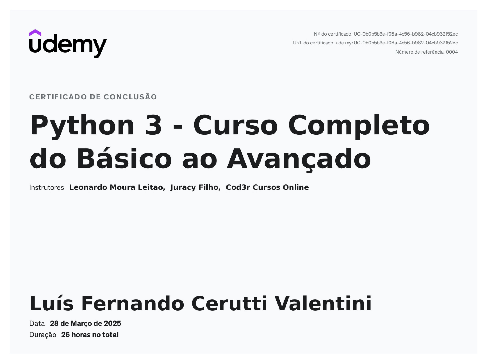
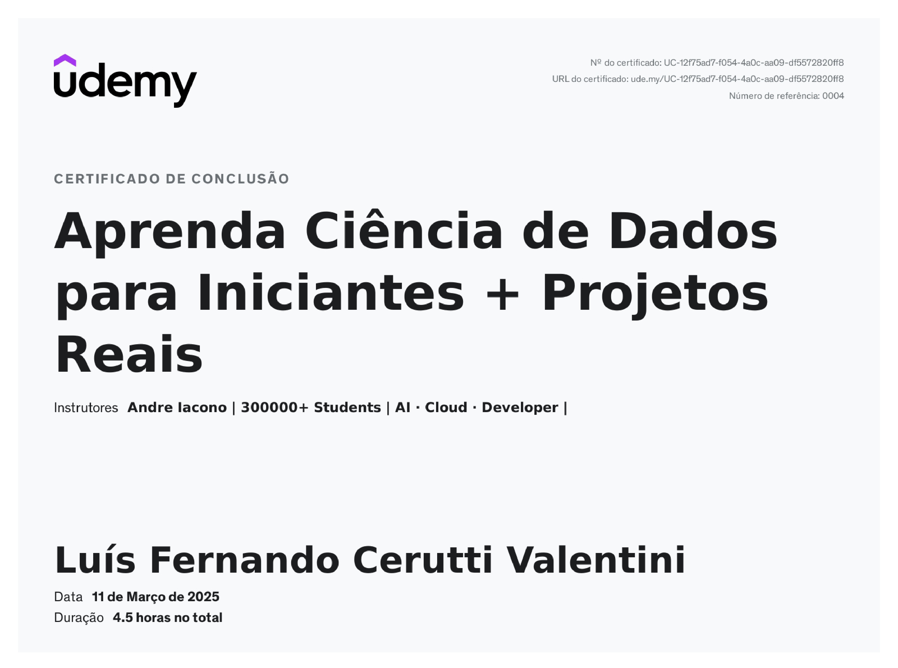
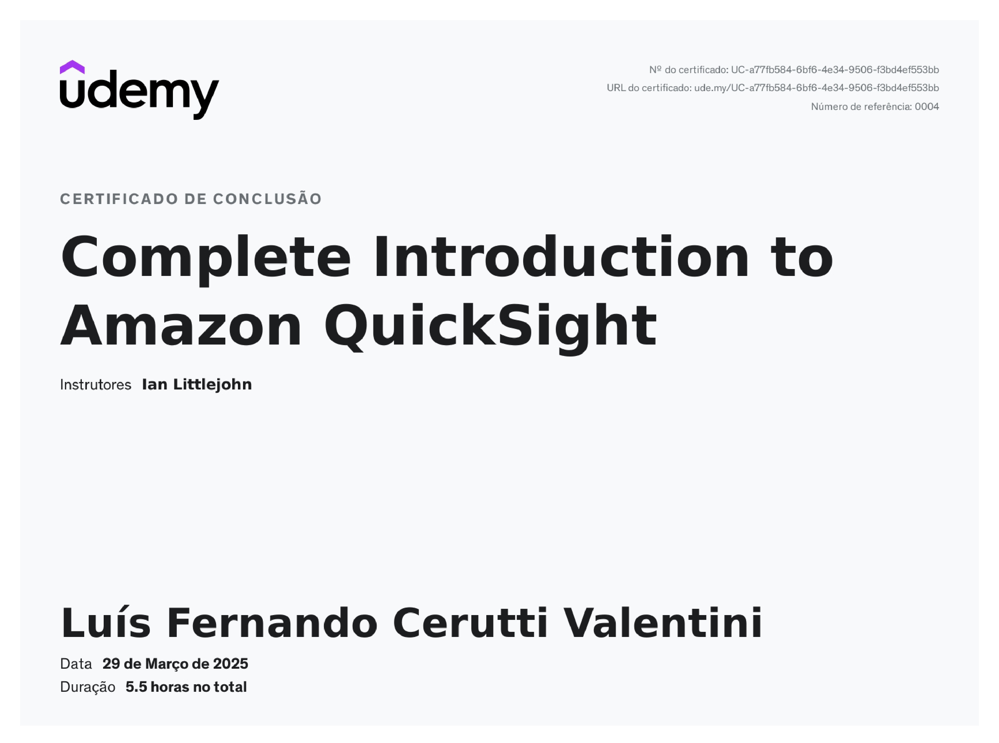

# Meus Cursos - Lista Completa

Nesse documento, estão todos os cursos que completei na Udemy e que fornecem certificado.

### Curso Node.js

Curso que engloba muitos conteúdos sobre o desenvolvimento back-end, focado no uso de Node.js. Entre os conteúdos do curso, destaca-se:

* Fundamentos do Node.js, execução assíncrona, NPM e bibliotecas de terceiros

* Express.js, middlewares, endpoints de API e rotas dinâmicas, estrutura de pastas

* Padrão MVC e organização
  
* Back-end integrado com banco de dados relacional (MySQL) e não relacional (MongoDB)

* ORMs para agilização (Sequelize para bancos SQL, Mongoose para MongoDB)

* Sessões, Cookies e Autenticação

* Validação, paginação, tratamento de erros, testes e deployment básicos e mais

### Curso SQL

Esse curso aborda os conteúdos básicos do SQL, incluindo:

* Comandos básicos, operadores e agregações

* Joins, subqueries/CTEs, uniões

* Boas práticas, funções e utilidades

### Curso Docker

Esse curso aborda tópicos essenciais do docker, incluindo:

* Criando e gerenciando imagens, containers, volumes e networks

* Principais comandos, YAML e docker-compose

* Docker Swarm e Kubernetes básicos, Dockerhub

### Curso Github

Curso breve que cobre os principais comandos do Git, criação de repositórios, branches, commits, sincronização com Github e mais.

### Curso Python

Esse curso decorre sobre a linguagem Python desde o mais básico até a criação de aplicações com banco de dados. Inclui fundamentos (variáveis, loops, condições, funções), manipulação de arquivos, OOP, programação funcional e integração com banco de dados SQL.

### Curso Pandas

Cobre o básico sobre a criação de projetos e configuração de ambientes (Jupyter Lab e Notebooks), importação e tratamento de dados, manipulação de dataframes com Pandas, Numpy e criação de gráficos com Matplotlib.

### Curso QuickSight

Curso breve sobre o serviço de Business Intelligence da AWS, criação de gráficos, dashboards interativos, tabelas, indicadores chave (KPI), entre outros tópicos.

